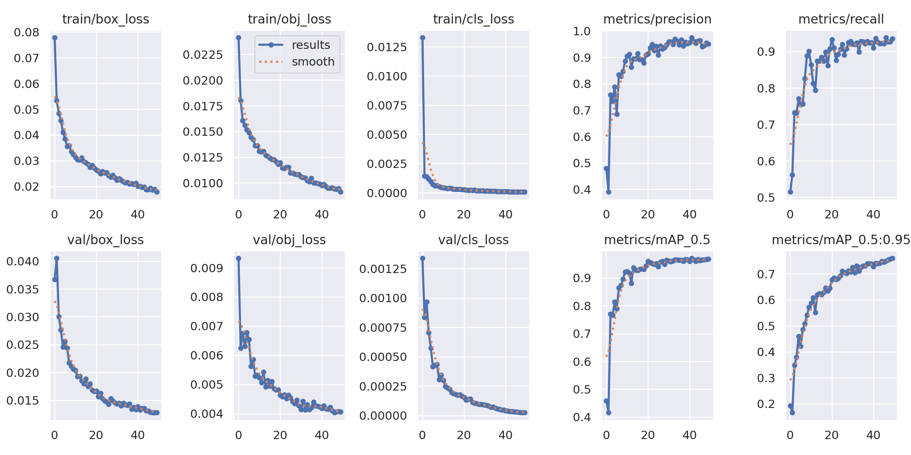
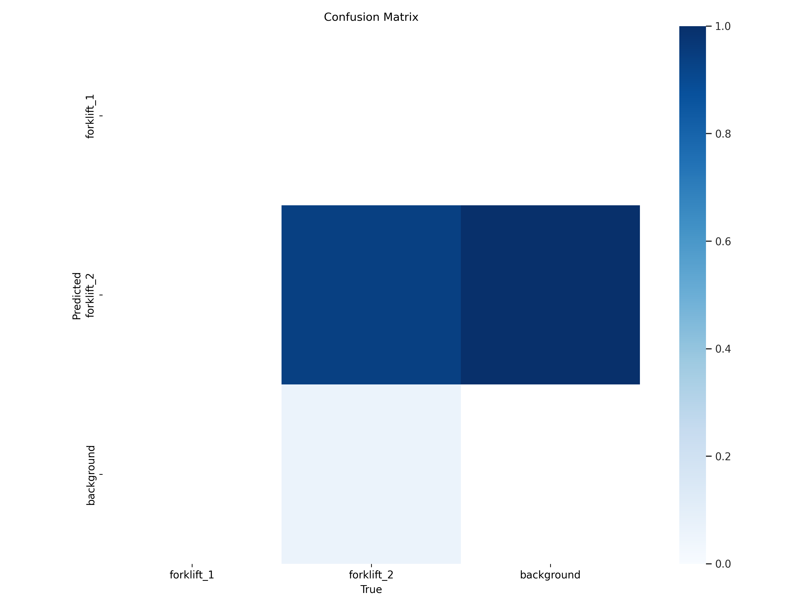
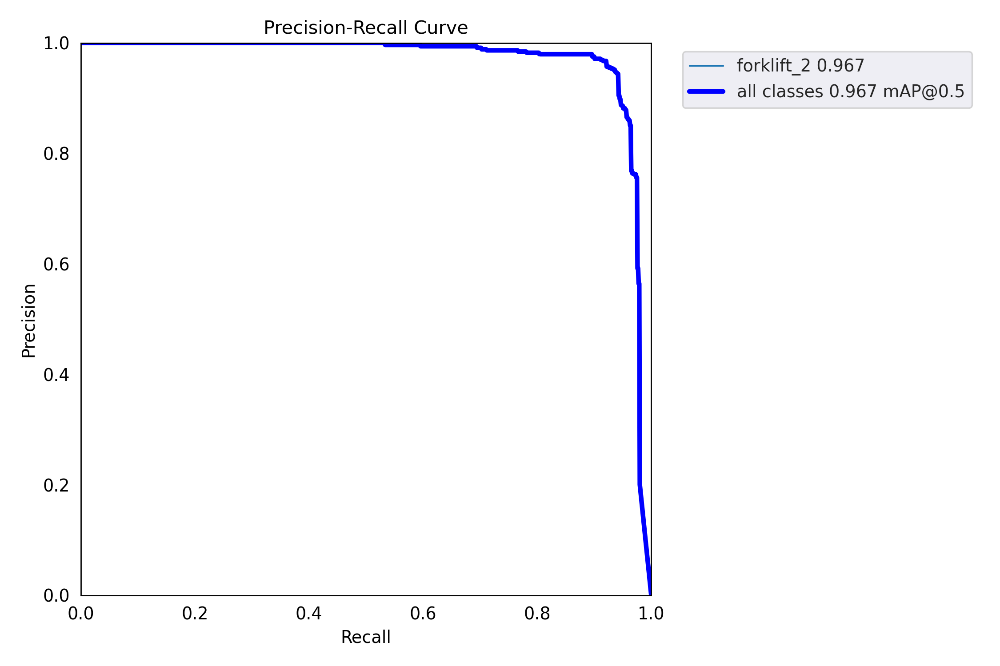
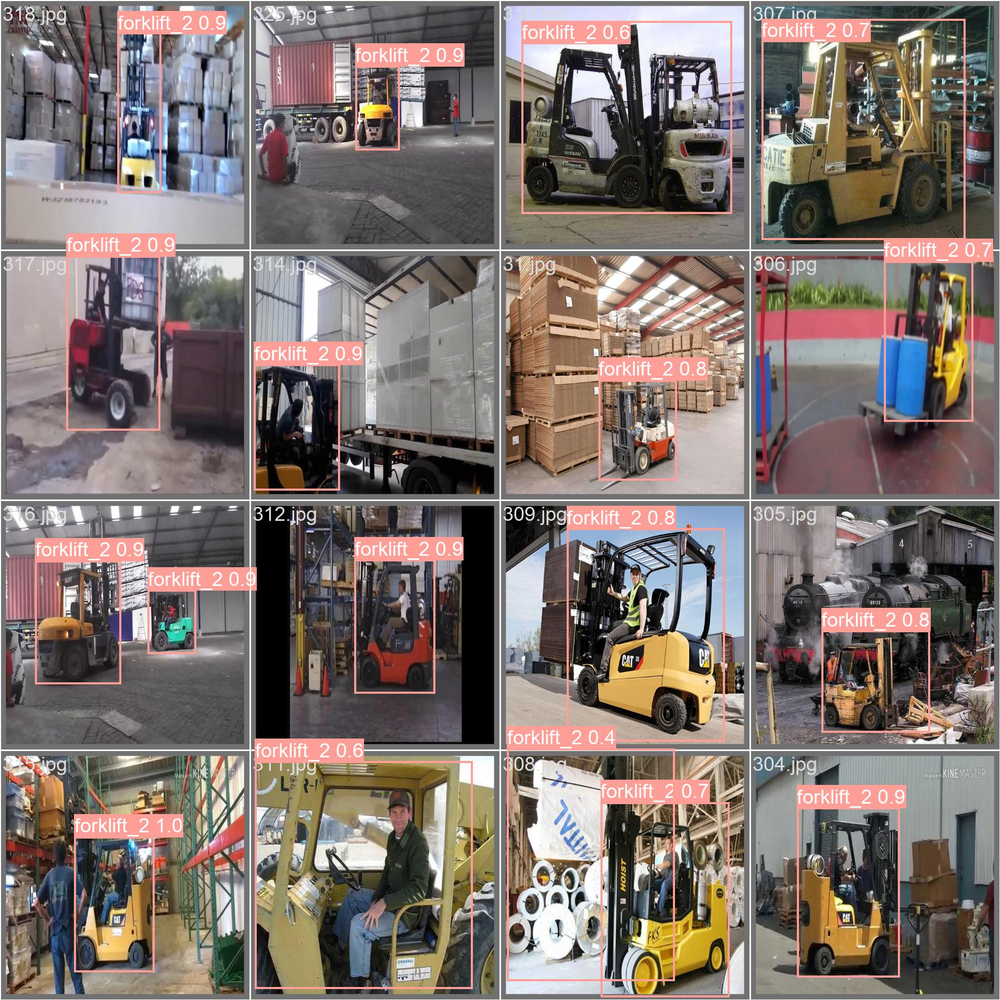

# Forklift Detection using YOLOv5

## Introduction
This project utilizes the YOLOv5 object detection model to identify forklifts within images or video frames. Forklift detection is crucial in industrial and logistical contexts for ensuring safety and operational efficiency. By leveraging deep learning techniques, particularly YOLOv5, we aim to develop an accurate and efficient solution for forklift detection.

## Result

<p align="center">
  
</p>

<p align="center"><em>Result</em></p> 

## Installation
1. Clone the YOLOv5 repository:
    ```
    git clone https://github.com/ultralytics/yolov5.git
    ```

2. Install dependencies:
    ```
    pip install -r requirements.txt
    ```

3. Clone this project repository:
    ```
    git clone <https://github.com/ToanNguyenKhanh/Forklift-Object-detection>
    ```

4. Navigate to the project directory:
    ```
    cd yolov5
    ```

## Usage
1. Prepare your dataset:
1. Prepare your dataset:
    - Download the forklift detection dataset from [Roboflow](https://universe.roboflow.com/nithesh-sanil-iud92/forklift-det).
    - Ensure your dataset contains images or video frames with annotated forklift instances.
    - Organize the dataset into appropriate directories, such as 'train' and 'val' for training and validation data.


2. Train the YOLOv5 model:
    - Modify the training configuration in the `train.yaml` file according to your dataset.
    - Train the model using the following command:
        ```
        python train.py --img 640 --epochs 50 --data forklift.yaml --weights yolov5n.pt
        ```

3. Evaluate the trained model:
    - Evaluate the trained model's performance on the validation set:
        ```
        python val.py --data dataset.yaml --weights runs/train/exp3/weights/best.pt --task val
        ```

4. Test the model on new images or video:
    - Use the trained model to detect forklifts in images:
        ```
        python detect.py --source <image_path> --weights runs/train/exp3/weights/best.pt --img 640
        ```
    - For video detection, replace `<image_path>` with the path to your video file.

5. Result







## Dataset Preparation
Ensure your dataset contains a sufficient number of diverse images or video frames depicting forklifts in various orientations, lighting conditions, and backgrounds. Annotated bounding boxes should accurately enclose the forklifts in the images.

## Model Configuration
Experiment with different YOLOv5 model variants (e.g., `yolov5s`, `yolov5m`, `yolov5l`, `yolov5x`) and adjust parameters such as input image size, batch size, and training epochs to optimize performance based on your specific requirements and computational resources.

## Contributing
Contributions to this project are welcome. Feel free to submit pull requests for bug fixes, enhancements, or additional features.

## License
This project is licensed under the MIT License. See the `LICENSE` file for details.

## Acknowledgments
- We acknowledge the YOLOv5 developers for their outstanding work on the object detection framework.
- Special thanks to the contributors and open-source community for their valuable contributions and support.

## Contact
For any inquiries or feedback, please contact [nktoan163@gmail.com].

## References
- YOLOv5 GitHub Repository: https://github.com/ultralytics/yolov5
- YOLOv5 Paper: [YOLOv5: End-to-End Real-Time Object Detection with YOLO]
  
## Disclaimer
This project is for educational and research purposes only.
